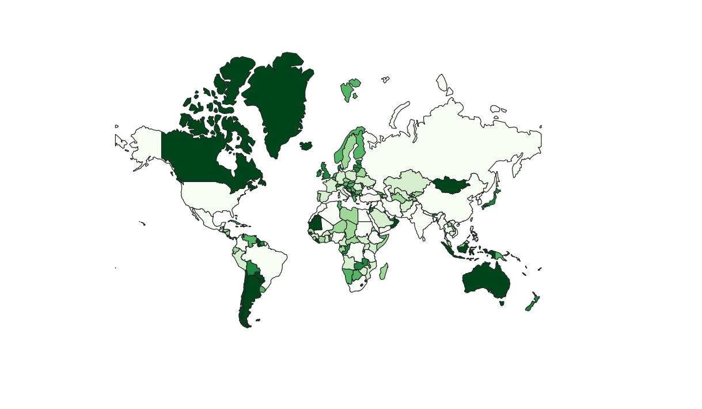
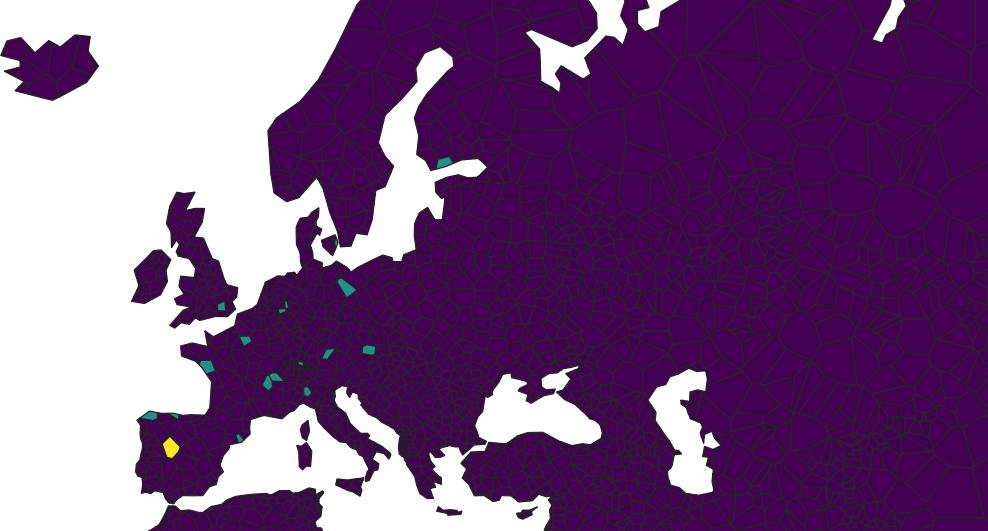

# PlaceCount Rasters

Generated from OpenStreetMap -- June 1 2021

OpenStreetMap® is open data, licensed under the Open Data Commons Open Database License (ODbL) by the OpenStreetMap Foundation (OSMF).

The copyright portion of _this_ work (PlaceCount Rasters) is placed under Open Data Commons Public Domain Dedication and License (PDDL)

As seen on TV https://unli.xyz/city/calc/

## What is this

Counts of (groups of OSM tags/keys, specific tags, or specific keys) which are selected and currated by me.

## How to use

These are raw counts. To make them useful you'll likey want to do population-weighted statistics. Here is one way to do so:

### Using exactextract

https://github.com/isciences/exactextract

```sh
wget https://raw.githubusercontent.com/chapmanjacobd/rasters/main/ne_110m_countries.gpkg
wget https://raw.githubusercontent.com/chapmanjacobd/rasters/main/pop.tif
wget https://raw.githubusercontent.com/chapmanjacobd/rasters/main/osm/walkable.tif.gz
gzip -d ./walkable.tif.gz

exactextract -r pop:pop.tif \
  -r variable:walkable.tif \
  -p ne_110m_countries.gpkg \
  -f NAME \
  -s "sum(pop)" \
  -s "sum(variable)" \
  -s "max(variable)" \
  -s "mean(variable)" \
  -s "pop_weighted_mean=weighted_mean(variable,pop)" \
  -o countries_walkable.csv

cat countries_walkable.csv
```

### Bonus I: Create a country map



```sh
ogr2ogr -append ne_110m_countries.gpkg countries_walkable.csv
ogr2ogr -sql "
    select cast(pop_sum as int) pop_sum
        , cast(variable_max as int) variable_max
        , cast(variable_mean as int) variable_mean
        , cast(pop_weighted_mean as int) pop_weighted_mean
        , output.*
    from output left join countries_walkable w on output.NAME = w.NAME
" final_output.geojson ne_110m_countries.gpkg
```

#### For higher quality Geometry, try this

```
wget https://raw.githubusercontent.com/nvkelso/natural-earth-vector/master/geojson/ne_10m_admin_0_countries.geojson
ogr2ogr -t_srs EPSG:3857 ne_10m_countries.geojson ne_10m_admin_0_countries.geojson -skiperrors && rm ne_10m_admin_0_countries.geojson
```

### Bonus II: Create a cities map



```sh
wget https://raw.githubusercontent.com/chapmanjacobd/rasters/main/ne_cities.gpkg

exactextract -r pop:pop.tif \
  -r variable:walkable.tif \
  -p ne_cities.gpkg \
  -f ne_id \
  -s "sum(pop)" \
  -s "sum(variable)" \
  -s "max(variable)" \
  -s "mean(variable)" \
  -s "pop_weighted_mean=weighted_mean(variable,pop)" \
  -o countries_walkable.csv

ogr2ogr -append ne_cities.gpkg countries_walkable.csv
ogr2ogr -sql "
    select cast(pop_sum as int) pop_sum
        , cast(variable_max as int) variable_max
        , cast(variable_mean as int) variable_mean
        , cast(pop_weighted_mean as int) pop_weighted_mean
        , output.*
    from output left join countries_walkable w on output.ne_id = w.ne_id
" final_output.geojson ne_cities.gpkg
```

#### Included Population (pop.tif) is WorldPop 2020

    WorldPop (www.worldpop.org - School of Geography and Environmental Science, University of Southampton; Department of Geography and Geosciences, University of Louisville; Departement de Geographie, Universite de Namur) and Center for International Earth Science Information Network (CIESIN), Columbia University (2018). Global High Resolution Population Denominators Project - Funded by The Bill and Melinda Gates Foundation (OPP1134076). https://dx.doi.org/10.5258/SOTON/WP00647 Creative Commons Attribution 4.0
